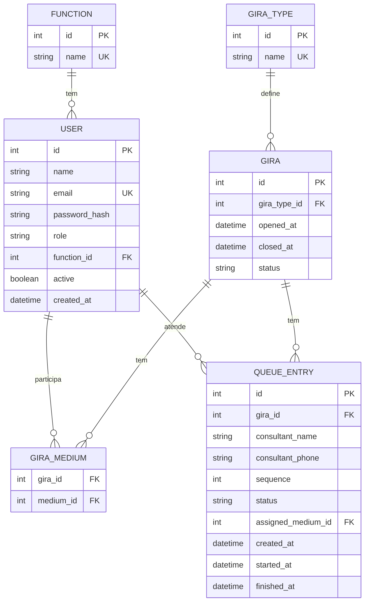

# Arquitetura do Projeto - Ogum Tech

## 📐 Visão Geral

Ogum Tech é uma aplicação web moderna desenvolvida para gerenciar filas de atendimento em giras de Umbanda. O projeto segue os princípios de arquitetura limpa, separação de responsabilidades e design minimalista.

## 🏗️ Arquitetura da Aplicação

### Stack Tecnológica

```
Frontend/Backend (Fullstack)
├── Next.js 15.5.6 (App Router)
├── React 18.3.1 (Server + Client Components)
├── TypeScript 5.x (Type Safety)
└── Tailwind CSS 4.x (Utility-First CSS)

Database & ORM
├── PostgreSQL (Supabase)
├── Prisma 5.22.0 (ORM)
└── Prisma Client (Type-safe queries)

Autenticação & Segurança
├── JWT (jose library)
├── bcryptjs (Password hashing)
├── Zod (Schema validation)
└── HTTP-only Cookies (Secure storage)

Deploy & Infraestrutura
├── Vercel (Serverless Deployment)
└── Supabase (PostgreSQL Database)
```

## 📁 Estrutura de Diretórios

```
ogum-tech/
├── prisma/
│   ├── schema.prisma          # Schema do banco de dados
│   └── seed.ts                # Dados iniciais (seed)
│
├── public/                    # Arquivos estáticos
│
├── src/
│   ├── app/                   # Next.js App Router
│   │   ├── actions/           # Server Actions
│   │   │   ├── admin.ts       # Ações administrativas
│   │   │   ├── auth.ts        # Autenticação e usuários
│   │   │   └── queue.ts       # Gerenciamento de filas
│   │   │
│   │   ├── dashboard/         # Área autenticada
│   │   │   ├── admin/         # Painel administrativo
│   │   │   ├── gira/[id]/     # Página de gira específica
│   │   │   ├── layout.tsx     # Layout com sidebar/header
│   │   │   └── page.tsx       # Lista de giras abertas
│   │   │
│   │   ├── login/             # Página de login
│   │   ├── globals.css        # Estilos globais
│   │   ├── layout.tsx         # Root layout
│   │   └── page.tsx           # Página inicial (redirect)
│   │
│   ├── components/            # Componentes React
│   │   ├── AdminForms.tsx     # Formulários administrativos
│   │   ├── GiraQueue.tsx      # Componente de fila
│   │   ├── Header.tsx         # Cabeçalho do dashboard
│   │   └── Sidebar.tsx        # Menu lateral
│   │
│   └── lib/                   # Bibliotecas e utilitários
│       ├── prisma.ts          # Cliente Prisma singleton
│       ├── supabase.ts        # Cliente Supabase (opcional)
│       └── validations.ts     # Schemas de validação Zod
│
├── .env                       # Variáveis de ambiente (local)
├── .gitignore                 # Arquivos ignorados pelo Git
├── eslint.config.mjs          # Configuração ESLint
├── next.config.ts             # Configuração Next.js
├── package.json               # Dependências e scripts
├── postcss.config.mjs         # Configuração PostCSS
├── tsconfig.json              # Configuração TypeScript
└── tailwind.config.ts         # Configuração Tailwind (gerado)
```

## 🔄 Fluxo de Dados

### 1. Autenticação

```
┌─────────────┐
│   Cliente   │
│  (Browser)  │
└──────┬──────┘
       │ POST /login
       ▼
┌─────────────────┐
│  Server Action  │
│  (auth.ts)      │
└────────┬────────┘
         │ 1. Valida com Zod
         │ 2. Busca usuário (Prisma)
         │ 3. Compara senha (bcrypt)
         │ 4. Gera JWT (jose)
         │ 5. Set HTTP-only cookie
         ▼
┌─────────────────┐
│   PostgreSQL    │
│   (Supabase)    │
└─────────────────┘
```

### 2. Gerenciamento de Giras

```
┌──────────────┐
│   Admin      │
│   Dashboard  │
└──────┬───────┘
       │ createGira()
       ▼
┌─────────────────┐
│  Server Action  │
│  (admin.ts)     │
└────────┬────────┘
         │ 1. Valida sessão (JWT)
         │ 2. Verifica role = admin
         │ 3. Cria gira (Prisma)
         ▼
┌─────────────────┐
│   Database      │
│   tables:       │
│   - giras       │
│   - gira_types  │
└─────────────────┘
```

### 3. Fila de Atendimento (Tempo Real)

```
┌──────────────┐       Auto-refresh
│   Operador   │◄──────────────────┐
│   (Client)   │                   │
└──────┬───────┘                   │
       │ addToQueue()              │
       ▼                           │
┌─────────────────┐                │
│  Server Action  │                │
│  (queue.ts)     │                │
└────────┬────────┘                │
         │ 1. Calcula sequence     │
         │ 2. Cria entry           │
         │ 3. Return success       │
         ▼                          │
┌─────────────────┐                │
│   Database      │                │
│   table:        │                │
│   queue_entries │                │
└─────────────────┘                │
         │                          │
         │ router.refresh()         │
         └──────────────────────────┘
              (5 segundos)
```

## 🗃️ Modelo de Dados

### Entidades Principais



### Relacionamentos

- **User ↔ Function**: N:1 - Cada usuário tem uma função (Médium, Cambone, Ogã)
- **Gira ↔ GiraType**: N:1 - Cada gira é de um tipo (Preto-Velho, Caboclo, etc)
- **Gira ↔ User**: N:M - Médiuns presentes na gira (via `gira_mediums`)
- **QueueEntry ↔ Gira**: N:1 - Fila pertence a uma gira específica
- **QueueEntry ↔ User**: N:1 - Atendimento pode ser atribuído a um médium

## 🎨 Padrões de Design

### 1. Server Components (Padrão)

```tsx
// app/dashboard/page.tsx
export default async function DashboardPage() {
  // Busca dados diretamente no servidor
  const result = await getOpenGiras()
  const giras = result.success ? result.giras : []
  
  return <div>{/* Renderiza UI */}</div>
}
```

**Vantagens:**
- Sem JavaScript no cliente (performance)
- SEO friendly
- Acesso direto ao banco de dados

### 2. Client Components (quando necessário)

```tsx
// components/GiraQueue.tsx
'use client'

export default function GiraQueue({ giraId, initialQueue }) {
  // State e interatividade no cliente
  const [queue, setQueue] = useState(initialQueue)
  
  // Auto-refresh
  useEffect(() => {
    const interval = setInterval(() => router.refresh(), 5000)
    return () => clearInterval(interval)
  }, [])
  
  return <div>{/* UI interativa */}</div>
}
```

**Quando usar:**
- Hooks (useState, useEffect, etc)
- Event handlers
- Browser APIs

### 3. Server Actions

```tsx
// app/actions/queue.ts
'use server'

export async function addToQueue(input: AddToQueueInput) {
  // Validação
  const validated = addToQueueSchema.parse(input)
  
  // Lógica de negócio
  const maxSequence = await prisma.queueEntry.findFirst({...})
  
  // Criação
  const entry = await prisma.queueEntry.create({...})
  
  return { success: true, entry }
}
```

**Benefícios:**
- Type-safe (TypeScript)
- Sem necessidade de API routes
- CSRF protection automático

## 🔐 Segurança

### Camadas de Proteção

1. **Autenticação JWT**
   - Token assinado com HS256
   - Expiração de 12 horas
   - Armazenado em HTTP-only cookie

2. **Autorização baseada em Roles**
   ```tsx
   async function requireAdmin() {
     const session = await getSession()
     if (!session || session.role !== 'admin') {
       throw new Error('Sem permissão')
     }
   }
   ```

3. **Validação de Inputs**
   ```tsx
   import { z } from 'zod'
   
   const loginSchema = z.object({
     email: z.string().email(),
     password: z.string().min(6),
   })
   ```

4. **SQL Injection Protection**
   - Prisma usa prepared statements automaticamente
   - ORM type-safe

5. **Password Hashing**
   ```tsx
   const hash = await bcrypt.hash(password, 10)
   const isValid = await bcrypt.compare(password, hash)
   ```

## ⚡ Performance e Otimização

### 1. Server-Side Rendering (SSR)
- Páginas renderizadas no servidor
- HTML completo no primeiro load
- Hydration mínima

### 2. Auto-refresh Inteligente
```tsx
// Refresh apenas quando necessário
useEffect(() => {
  const interval = setInterval(() => {
    router.refresh() // Revalida Server Components
  }, 5000)
  return () => clearInterval(interval)
}, [router])
```

### 3. Prisma Connection Pooling
```env
DATABASE_URL="...?pgbouncer=true&connection_limit=1"
```

### 4. CSS Otimizado
- Tailwind CSS (utility-first, tree-shaking)
- Sem runtime CSS-in-JS
- Estilos inline (performance máxima)

## 🚀 Deploy

### Infraestrutura

```
┌─────────────────────────────────────┐
│          Vercel (Edge Network)      │
│  ┌───────────────────────────────┐  │
│  │   Next.js App (Serverless)    │  │
│  │   - Server Components         │  │
│  │   - Server Actions            │  │
│  │   - API Routes (se houver)    │  │
│  └───────────┬───────────────────┘  │
└──────────────┼──────────────────────┘
               │
               │ PostgreSQL Protocol
               │ (SSL/TLS)
               ▼
┌─────────────────────────────────────┐
│      Supabase (AWS)                 │
│  ┌───────────────────────────────┐  │
│  │   PostgreSQL 15               │  │
│  │   - Connection Pooling        │  │
│  │   - Backups automáticos       │  │
│  └───────────────────────────────┘  │
└─────────────────────────────────────┘
```

### Variáveis de Ambiente (Vercel)

```env
DATABASE_URL=postgresql://...
DIRECT_URL=postgresql://...
NEXTAUTH_SECRET=<secret-key>
```

### CI/CD Automático

1. Push para `main` → Vercel detecta
2. Build automático (`npm run build`)
3. Deploy em edge locations globalmente
4. Zero downtime

## 📊 Monitoring e Logs

### Logs da Vercel
- Runtime logs (erros, warnings)
- Build logs
- Analytics de performance

### Database Metrics (Supabase)
- Conexões ativas
- Queries por segundo
- Tamanho do banco
- Backups automáticos

## 🔮 Roadmap Futuro

### Funcionalidades Planejadas
- [ ] Cadastro de consulentes (autocomplete)
- [ ] Relatórios de atendimento
- [ ] Estatísticas de giras
- [ ] Notificações em tempo real (WebSockets)
- [ ] PWA (Progressive Web App)
- [ ] Dark mode toggle

### Melhorias Técnicas
- [ ] Testes E2E (Playwright)
- [ ] Testes unitários (Vitest)
- [ ] Storybook para componentes
- [ ] CI/CD com testes automatizados
- [ ] Docker para desenvolvimento local

## 📝 Convenções de Código

### Nomenclatura
- **Componentes**: PascalCase (`AdminForms.tsx`)
- **Funções**: camelCase (`getOpenGiras`)
- **Constantes**: UPPER_SNAKE_CASE (`JWT_SECRET`)
- **Arquivos**: kebab-case para rotas, PascalCase para componentes

### Estrutura de Commits
```
feat: nova funcionalidade
fix: correção de bug
docs: documentação
style: formatação, estilos
refactor: refatoração de código
perf: melhorias de performance
test: adição de testes
chore: tarefas de manutenção
```

## 🤝 Contribuindo

1. Fork o projeto
2. Crie uma branch (`git checkout -b feature/nova-funcionalidade`)
3. Commit suas mudanças (`git commit -m 'feat: adiciona nova funcionalidade'`)
4. Push para a branch (`git push origin feature/nova-funcionalidade`)
5. Abra um Pull Request

## 📄 Licença

Este projeto está sob a licença MIT. Veja o arquivo `LICENSE` para mais detalhes.

## 👨‍💻 Autor

Desenvolvido por [Mateus](https://github.com/dev-mateus)

---

**Ogum Tech** - Sistema moderno de gestão de giras de Umbanda
